# Zenzele Smart Market Project Specification

***NOTE: This is a guide. It has been AI edited. Help refine it by prunning irrelevant ideas. Diagrams will be audited and redrawn.

## Global Open-Source Cardano Entrepreneur Marketplace

**Project name:** Zenzele Smart Market  
**Meaning of Zenzele:** Be self-reliant.  
**Project type:** Open-source Web2 and Web3 entrepreneur marketplace.  
**Blockchain:** Cardano.  
**Wallet:** Coxy Wallet. The web app must use Coxy Wallet without requiring users to install a browser extension.  
**Primary repository:** https://github.com/wimsio/zenzelesmartmarket  
**Website:** https://zenzelesmartmarket.co/  
**Contest deadline:** 5 June 2026.  


# 1. Purpose of This Specification

This specification guides developers who will build Zenzele Smart Market during the open-source developer contest. It explains what the system must do, how the main components must interact, how user flows must behave, how Cardano and Coxy Wallet must be integrated, and how developers must document their work.

Developers must not guess the purpose of the project. Zenzele Smart Market exists to help ordinary people become self-reliant by giving them a simple digital platform where they can promote their skills, products, services, training needs, funding needs, and entrepreneurial journey.

The platform must serve people from any country. It must not be designed as an Africa-only application. Africa is an important starting point and inspiration, but the system must support international users, multiple countries, multiple languages, and future localization.

The app must be easy to use for non-technical people. A person who has never used blockchain before must still be able to create a profile, tell their story, browse entrepreneurs, follow people, request support, and understand what the platform is doing.

# 2. Product Vision

Zenzele Smart Market aims to become the decentralized people’s entrepreneurial market. It combines social storytelling, entrepreneur profiles, marketplace listings, donations, training requests, NFT identity, and Cardano-powered transparency into one lightweight web app.

The platform must help unemployed people, freelancers, students, creators, artisans, small business owners, informal traders, and early-stage entrepreneurs become visible. It must give them a public profile, a voice story, a way to request donations or training, and a way to show progress over time.

The system must be useful even before advanced blockchain features are complete. The Web2 features must allow user onboarding, profiles, browsing, following, likes, views, activity history, and training requests. The Web3 features must add wallet login, Cardano donations, NFT minting, blockchain transaction references, and future smart contract flows.

# 3. Required Technology Stack

The project must use simple and accessible technologies so that many developers can contribute.

The frontend must be built with HTML, CSS, and JavaScript. Developers may organize the JavaScript into modules, but they must not require heavy frontend frameworks for the first contest version. The app must load quickly on mobile connections and must avoid unnecessary JavaScript bundles.

The backend must be built with PHP and MySQL. PHP must expose clear server endpoints for authentication, profile management, audio metadata, NFT metadata records, social actions, donations, training requests, notifications, and admin review functions.

The Cardano on-chain logic must use Haskell and Plutus where smart contracts are required. The Cardano off-chain transaction-building logic must use Lucid. Developers must keep wallet interaction code separate from business logic so that it is easy to test and review.

The app must use Coxy Wallet. Coxy Wallet must work without requiring users to install a browser extension. The user must be guided through wallet connection in the web app in a simple way. If a user has no wallet yet, the app must explain how to create or access a Coxy Wallet without forcing them to understand technical blockchain terminology.

The project must use GitHub for collaboration. Developers must fork the repository, commit their code, push changes to their forks, and submit pull requests. Developers must not commit private keys, passwords, seed phrases, API tokens, production credentials, or personal secrets.

# 4. Performance and Data Usage Requirements

Zenzele Smart Market must be fast and must use small amounts of data. This is a core requirement because many target users may have limited internet access, expensive data, or low-end mobile phones.

Pages must avoid large images unless those images are optimized. Profile images and marketplace images must be compressed before display. Audio files must be compressed to a reasonable quality level so that users can listen without wasting data. The app must show file size warnings before upload where possible.

The first page load must be lightweight. The homepage must not load every profile, every NFT, or every audio file at once. It must load only the necessary content and then fetch more content when the user scrolls, searches, or selects a category.

The app must use pagination or lazy loading for feeds, search results, profiles, activities, donations, and marketplace listings. No endpoint should return unlimited data.

JavaScript must be written in a way that keeps the interface responsive. Long-running operations such as audio processing, file uploads, wallet transaction preparation, and blockchain confirmation checks must show clear progress messages to the user.

# 5. User Roles

The system must support several user roles. A single user may have more than one role over time.

A visitor is a person who has not logged in. A visitor can browse public profiles, view public marketplace listings, listen to public audio stories, see public NFT records, and use share buttons. A visitor cannot like, follow, donate through a logged-in flow, create content, or request training until they create an account or connect a wallet.

An entrepreneur is a registered user who creates a public profile to promote their work. An entrepreneur can describe their skills, products, services, goals, training needs, and funding needs. An entrepreneur can create audio stories, request donations, mint entrepreneur NFTs, list items in the marketplace, and receive followers.

A supporter is a registered user who follows entrepreneurs, likes profiles, shares profiles, donates funds, buys NFTs, buys marketplace items, or sponsors training. A supporter can also become an entrepreneur later.

A mentor is a user who offers training, guidance, or support. A mentor can view training requests, accept requests, communicate with entrepreneurs through approved contact methods, and later issue training completion records or certificates.

An administrator is a trusted project operator who reviews reports, manages featured content, monitors abuse, verifies accounts, and handles contest/project moderation. Administrators must not have access to private keys or wallet seed phrases.

A developer contestant is a contributor who builds or improves the open-source project. Developer contestants must follow the repository rules, document AI usage, write tests, and submit pull requests.

# 6. Core Functional Requirements

## 6.1 User Signup and Login

The app must allow a user to create an account using basic registration details. At minimum, the system must support a username, email address or phone number where applicable, password or secure login method, country, preferred language, and account type.

The system must validate input before saving it. A username must not be empty. An email address must be valid when email is used. Passwords must be hashed before storage. Plain text passwords must never be stored in MySQL.

The login page must be simple. It must clearly show whether the user is logging in with account credentials or connecting with Coxy Wallet. If wallet login is used, the app must ask Coxy Wallet to sign a login challenge. The server must verify the signed challenge before creating a session.

The app must provide a logout function. Logout must destroy the server session and clear any local authentication state from the browser.

## 6.2 Coxy Wallet Connection

The app must use Coxy Wallet as the Cardano wallet. Coxy Wallet must not require browser extension installation. The connection flow must be friendly to new users.

When the user clicks “Connect Coxy Wallet,” the app must start a wallet connection request. The app must explain that the wallet is used to prove ownership, receive donations, mint NFTs, and sign Cardano transactions. The app must never ask the user to type a seed phrase into Zenzele Smart Market.

The wallet connection must return or expose the user’s public wallet address. The public wallet address may be stored in the database as part of the user profile. Private keys, seed phrases, and signing secrets must never be stored by Zenzele Smart Market.

If the user rejects the wallet connection, the app must show a calm error message and allow the user to continue using non-wallet features where possible.

If the user changes wallet accounts, the app must detect the change before signing transactions and must ask the user to confirm that the connected wallet is correct.

## 6.3 Entrepreneur Profile

Every registered user must be able to create an entrepreneur profile. The profile must include the user’s display name, business or hustle name, country, city or region, preferred language, short bio, detailed story, skills, business category, profile image, contact links, social links, Coxy Wallet address, and visibility settings.

The profile page must explain the entrepreneur clearly. A visitor must be able to understand what the person does, what they offer, what support they need, and how to help them.

Profiles must have public engagement information such as views, likes, hearts, stars, followers, following, donation totals where public, training requests, NFTs, marketplace listings, and activity history.

The user must be able to edit their profile. Changes must be validated. The system must keep timestamps for profile creation and profile updates.

## 6.4 Audio Storytelling

The app must allow entrepreneurs to record or upload an audio story. The audio story must explain who the entrepreneur is, what they do, what problem they solve, what support they need, and what goal they are working toward.

The browser must request microphone permission only when the user starts recording. If permission is denied, the app must explain how the user can upload an audio file instead.

The app must allow playback before saving. The user must be able to delete and re-record before publishing. The interface must show the audio length and, where possible, the approximate upload size.

The system must support optional background soft music. The user must be able to select “no music” or choose from approved music styles. The app must ensure that background music does not make the voice difficult to hear.

The backend must store the audio file path, audio duration, music selection, user ID, visibility setting, and creation timestamp. The actual audio file may be stored on the server, IPFS, or another approved storage option depending on implementation stage.

## 6.5 Entrepreneur NFTs

The app must allow entrepreneurs to create NFTs that represent their business identity, product, service, achievement, training certificate, campaign, or story.

The NFT creation form must ask for a title, description, category, image, optional audio story, owner wallet address, and metadata fields. The user must preview the NFT information before minting.

The app must explain NFTs in simple language. It must describe the NFT as a digital proof or certificate connected to the entrepreneur’s story, work, service, or achievement.

When minting is implemented, the app must use Lucid to build the Cardano transaction and Coxy Wallet to sign it. The transaction must be submitted to Cardano, and the resulting transaction hash must be stored in MySQL.

The system must store NFT metadata before and after minting. If minting fails, the app must keep the draft and allow the user to retry.

## 6.6 Donations and Funding Requests

Entrepreneurs must be able to create donation requests. A donation request must explain the amount needed, the reason for the request, the deadline if any, and how the money will help the entrepreneur.

Supporters must be able to donate using Cardano through Coxy Wallet. The app must show the recipient address, amount, network, and transaction summary before the supporter signs.

The app must never move user funds without explicit wallet confirmation. All transactions must be signed by the user in Coxy Wallet.

After a transaction is submitted, the app must store the transaction hash, donor user ID where available, recipient user ID, amount, currency or asset unit, status, and timestamp.

The app must show donation status clearly. A donation may be pending, confirmed, failed, or cancelled. The user must not be misled into thinking a donation is confirmed before confirmation is available.

## 6.7 Training Requests

Entrepreneurs must be able to request training. A training request must include the training category, description, current skill level, preferred language, country or time zone, whether online or in-person training is preferred, and what outcome the entrepreneur wants.

Mentors must be able to browse training requests and offer help. The app must allow administrators or future moderation tools to prevent spam and abuse.

Training categories must include coding, AI, farming, digital marketing, business management, finance, fashion, music production, carpentry, graphic design, sales, bookkeeping, and entrepreneurship. The system must allow new categories to be added later.

## 6.8 Social Engagement

The app must support likes, hearts, stars, views, followers, following, bookmarks, and shares.

A view must be counted when a profile or listing is opened. Developers must prevent obvious repeated refresh abuse from inflating counts too easily. A simple first version may track views by user ID or session and time window.

A user must be able to follow another entrepreneur. The profile page must show follower count and following count. The user must be able to see the people they follow.

Likes, hearts, and stars must be stored separately so the interface can show different forms of engagement. A user must not be able to submit unlimited duplicate reactions to the same item unless the design intentionally allows reaction updates.

Share buttons must allow the user to share public profile or listing URLs to WhatsApp, TikTok where possible, Facebook, Instagram where possible, Telegram, and X. If a platform does not support direct web sharing to a specific app action, the app must still provide a copyable link.

## 6.9 Marketplace

The marketplace must allow entrepreneurs to list products, services, digital goods, training, consultations, or creative work.

A listing must include a title, description, price if applicable, currency, images, category, seller profile, country, delivery or service method, and status.

The first version may record interest or contact requests before full Cardano payment automation is complete. Later versions may add Cardano payments, escrow, royalties, and NFT-based ownership.

## 6.10 Activity History

The system must record important user activities so that entrepreneurs and supporters can see progress over time.

Activity history must include profile creation, profile updates, audio story creation, NFT drafts, NFT minting, donations received, donations sent, followers gained, training requests created, marketplace listings created, and important status changes.

Activity records must include the actor user ID, target entity, action type, timestamp, and human-readable description.

# 7. Non-Functional Requirements

The system must be secure. All user input must be validated and escaped. SQL queries must use prepared statements. Passwords must be hashed with a modern password hashing function. File uploads must be checked for type and size. The app must not trust client-side validation alone.

The system must be usable. Buttons must have clear labels. Error messages must explain what happened and what the user can do next. The app must avoid blockchain jargon unless the term is explained.

The system must be accessible. Text must have readable contrast. Forms must have labels. Important actions must be usable on mobile devices. Pages must not depend only on color to communicate meaning.

The system must be maintainable. Code must be organized into clear folders for frontend assets, PHP endpoints, database scripts, Cardano logic, tests, documentation, and AI usage records.

The system must be testable. Developers must include tests for important functions and document how to run them.

# 8. Recommended Repository Structure

```text
zenzelesmartmarket/
  public/
    index.html
    assets/
      css/
      js/
      images/
  app/
    config/
    controllers/
    models/
    services/
    views/
  api/
    auth/
    profiles/
    audio/
    nfts/
    donations/
    training/
    social/
    marketplace/
  database/
    schema.sql
    seed.sql
    migrations/
  cardano/
    plutus/
    lucid/
    metadata/
  tests/
    php/
    js/
    cardano/
  docs/
    SPECIFICATION.md
    API.md
    DATABASE.md
    SECURITY.md
    USER_GUIDE.md
  AI_USAGE.md
  README.md
```

This structure is recommended so that contributors can quickly find the right files. If a team uses a different structure, they must explain it clearly in the README.

# 9. Database Requirements

The database must be MySQL. Tables must use primary keys, timestamps, and appropriate indexes.

At minimum, the system should include tables for users, profiles, wallet connections, audio stories, NFTs, donation requests, donations, followers, reactions, views, training requests, marketplace listings, activity history, notifications, languages, translations, and audit logs.

Developers must not store private keys, wallet seed phrases, or wallet passwords. Only public wallet addresses and transaction references may be stored.

The database must use foreign keys where practical. If foreign keys are not used in the first version, developers must document why and must still maintain referential integrity in application code.

# 10. API Requirements

The PHP backend must expose clear endpoints. Each endpoint must validate input, check authorization where needed, return JSON for API calls, and use consistent response formats.

A successful response should include a success flag, data object, and message where useful. A failed response should include a success flag set to false, an error code, and a human-readable message.

Example response format:

```json
{
  "success": true,
  "message": "Profile saved successfully.",
  "data": {
    "profile_id": 123
  }
}
```

Example error response:

```json
{
  "success": false,
  "error_code": "VALIDATION_ERROR",
  "message": "The business name is required."
}
```

# 11. Cardano and Coxy Wallet Requirements

The app must treat Coxy Wallet as the user-controlled signing tool. Zenzele Smart Market must prepare transactions, but the wallet must sign them.

The wallet connection process must support public address retrieval, challenge signing for login where implemented, transaction signing, and transaction submission.

Lucid must be used for off-chain transaction construction. Plutus and Haskell must be used for smart contract logic where on-chain validation is needed.

The first Cardano features should focus on practical use cases. These include linking a wallet to a profile, receiving donations, recording transaction hashes, and minting entrepreneur NFTs. More complex features such as escrow, milestone funding, DAO voting, and reputation contracts can be added in later milestones.

# 12. AI Usage Requirements

Because this is an AI-assisted developer contest, every contributor or team must include an `AI_USAGE.md` file.

The file must explain what AI tools were used, what type of LLM was used, what prompts were used, what outputs were generated, what code or documentation was accepted, and what was manually changed.

Developers must not hide AI usage. The goal is not to punish AI usage. The goal is to make development transparent, reproducible, and educational.

A good AI usage record must include enough detail for another developer to understand how the result was produced.

# 13. Security Rules

The application must never request or store a wallet seed phrase. If any page asks the user for a seed phrase, that implementation must be rejected.

The application must never commit secrets to GitHub. Developers must use example configuration files such as `.env.example` and must keep real secrets outside the repository.

All SQL must use prepared statements. File uploads must be checked. User-generated content must be escaped before display. Admin features must require authorization. Sensitive server errors must not be shown directly to users.

Wallet signing must clearly show the action being signed. A user must know whether they are signing in, minting an NFT, sending a donation, or making another blockchain transaction.

# 14. Testing Requirements

Developers must write tests for important units of logic. PHP tests should cover validation, database services, authentication helpers, profile saving, donation records, and training request logic.

JavaScript tests should cover form validation, wallet connection state handling, reaction buttons, pagination logic, and API response handling.

Cardano tests should cover NFT metadata creation, transaction-building logic, and Plutus validator behavior where implemented.

Developers must include instructions for running tests. A pull request without testing instructions is incomplete.

# 15. System State Diagrams

The following Mermaid diagrams describe important system states. Developers may copy these diagrams into GitHub Markdown files that support Mermaid.

## 15.1 User Account State Diagram

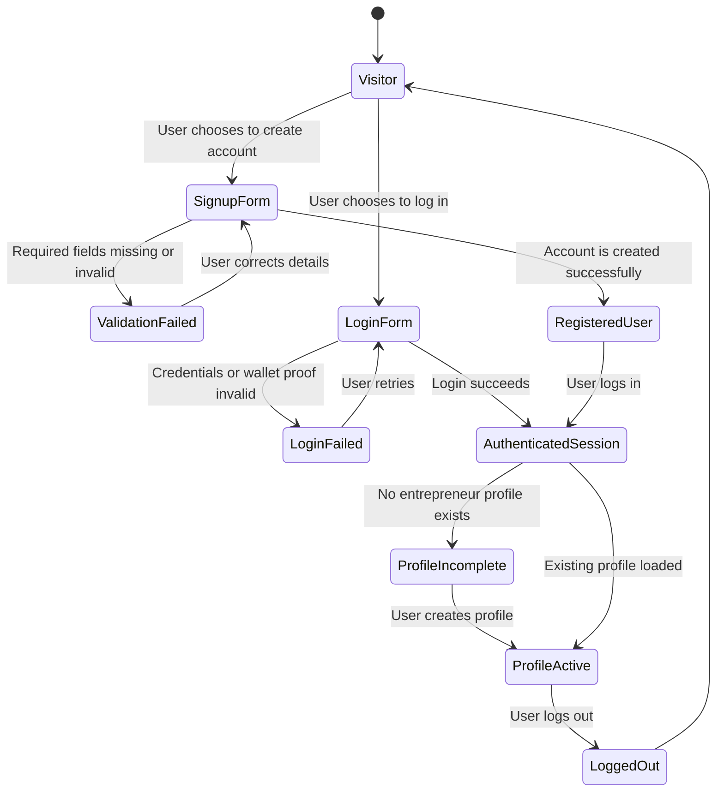

## 15.2 Coxy Wallet Connection State Diagram

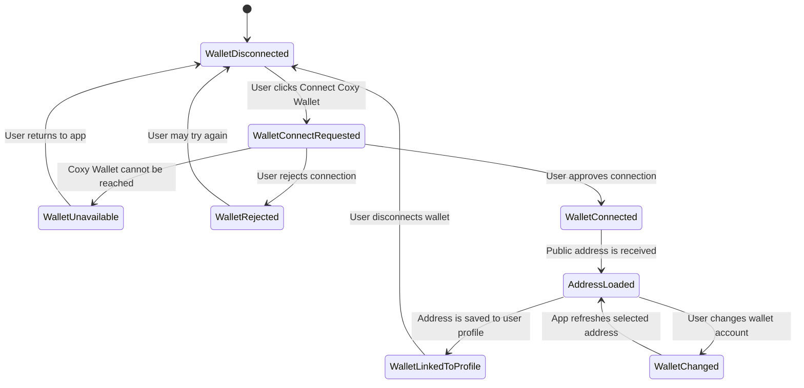

## 15.3 Entrepreneur NFT Minting State Diagram

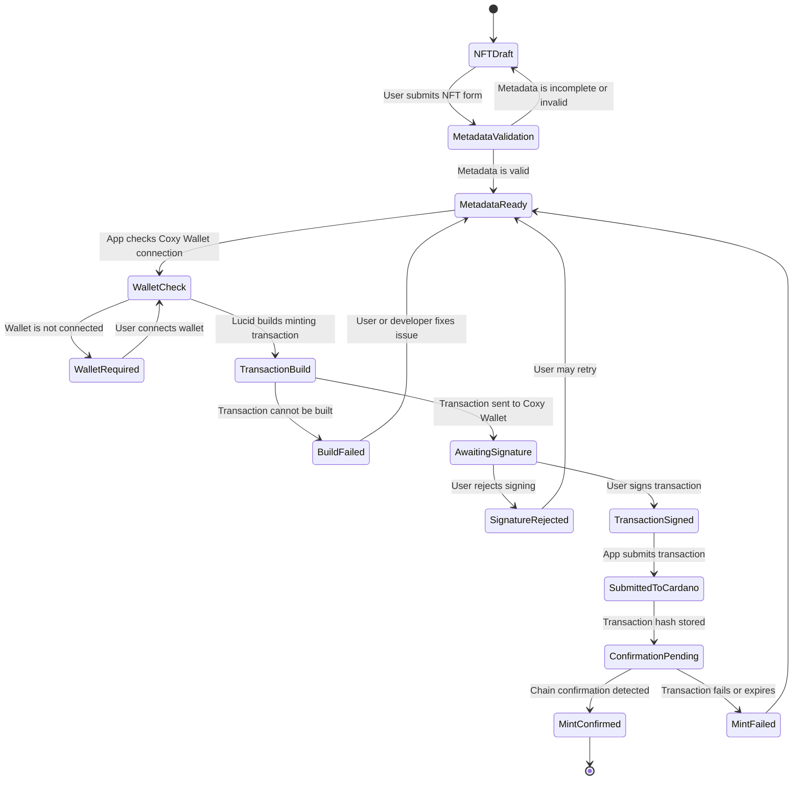

## 15.4 Donation State Diagram

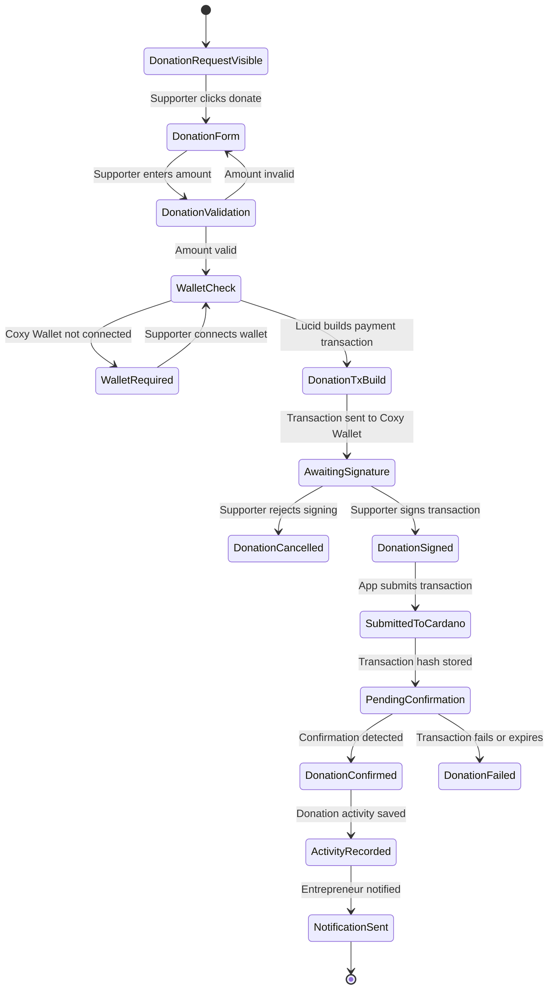

## 15.5 Training Request State Diagram

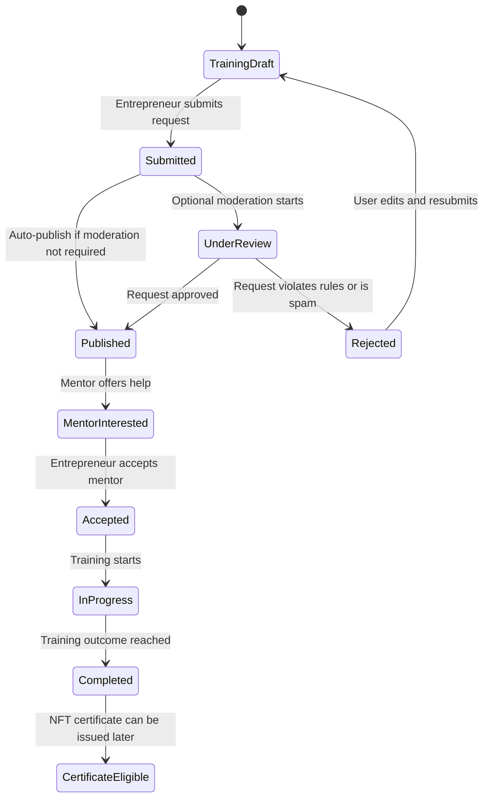

# 16. System Sequence Diagrams

The following sequence diagrams show how the main components interact.

## 16.1 Signup and Profile Creation Sequence

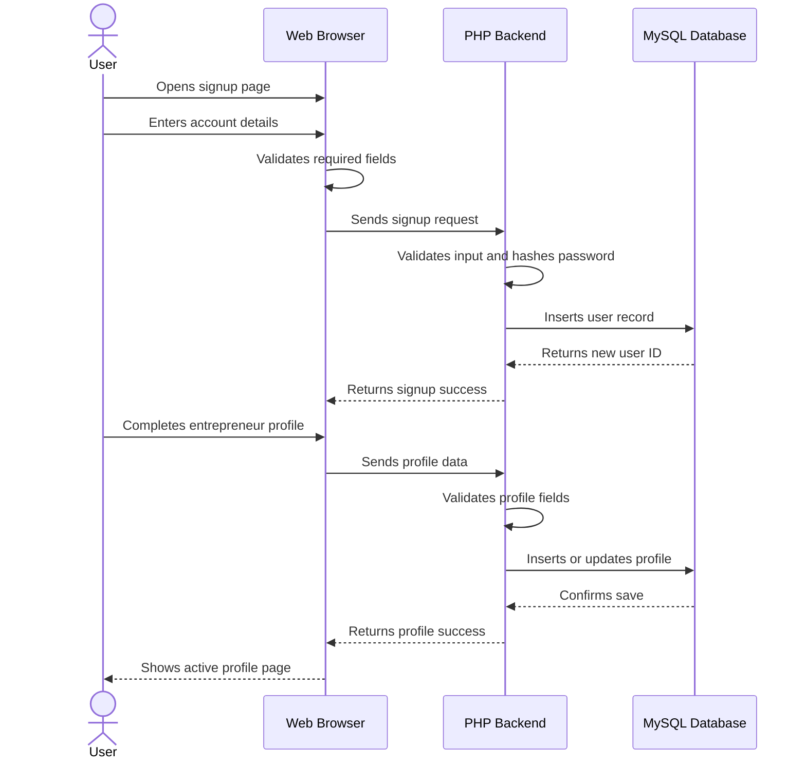

## 16.2 Coxy Wallet Login Sequence

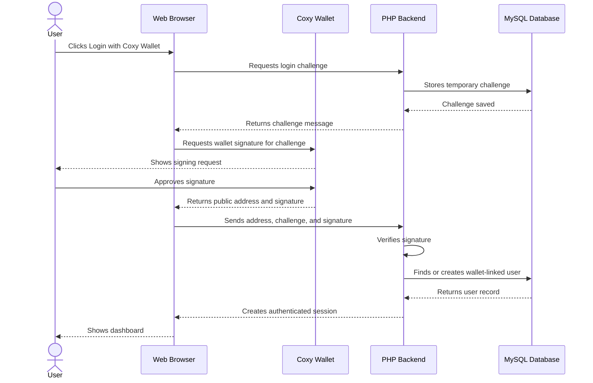

## 16.3 Audio Story Upload Sequence

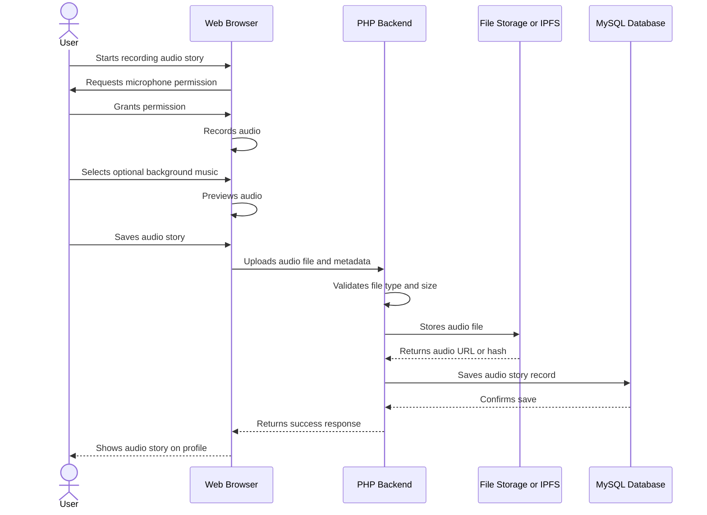

## 16.4 NFT Minting Sequence

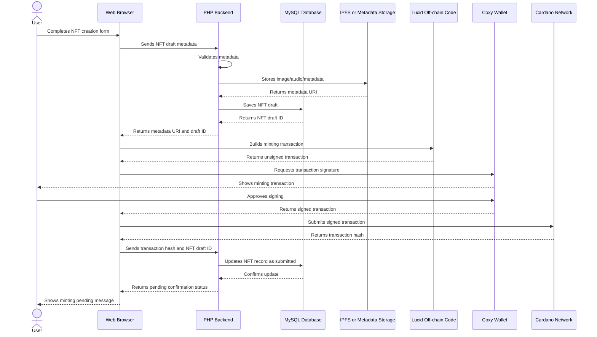

## 16.5 Donation Sequence

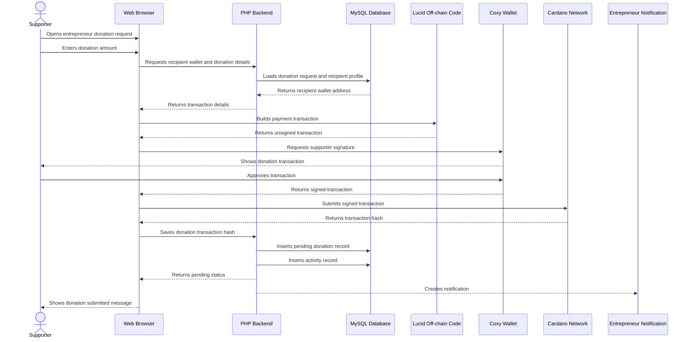

## 16.6 Follow and Engagement Sequence

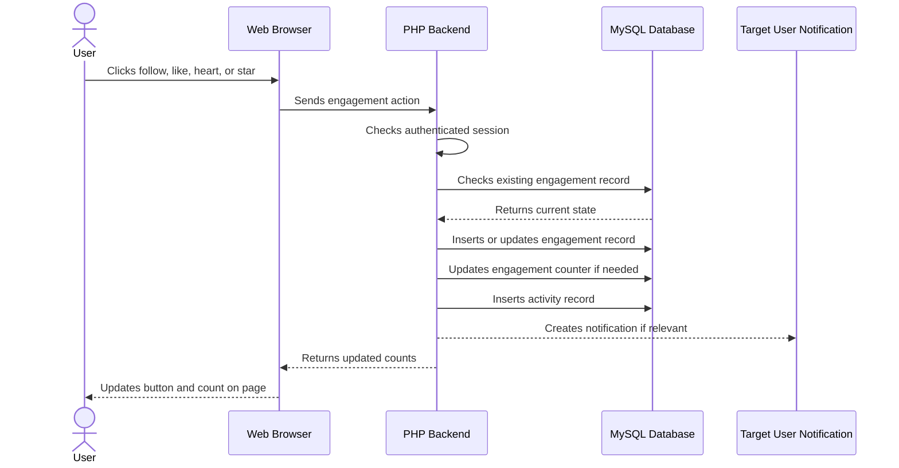

# 17. Pull Request Requirements

Every pull request must explain what was changed, why it was changed, how it was tested, and whether AI was used.

A pull request should include screenshots for user interface changes. It should include database migration notes for database changes. It should include security notes for authentication, wallet, file upload, donation, or smart contract changes.

A pull request should be small enough to review. Developers should avoid mixing unrelated changes in one pull request.

# 18. Minimum Viable Product Requirements

The minimum viable product must allow a user to sign up, log in, create an entrepreneur profile, browse profiles, follow users, like profiles, record or upload an audio story, create a donation request, connect Coxy Wallet, display a wallet address, and create an NFT metadata draft.

A stronger MVP should also include Cardano transaction submission for donations, NFT minting through Lucid and Coxy Wallet, multilingual interface support, training requests, marketplace listings, activity history, and admin moderation.


# 19. Definition of Done

A feature is done only when it works for the user, validates input, handles errors, stores data correctly, displays useful feedback, works on mobile, avoids unnecessary data usage, and includes basic tests or testing notes.

A blockchain feature is done only when the user understands what they are signing, Coxy Wallet signs the transaction, the transaction hash is stored, failure states are handled, and no private key or seed phrase is exposed.

A documentation feature is done only when another developer can understand how to install, run, test, and review it.

# 20. Final Developer Guidance

Developers must build Zenzele Smart Market for real people, not only for judges. The app must help someone with a small business, a skill, a dream, or no job take a practical step toward self-reliance.

The best submissions will not simply have many features. The best submissions will be clear, fast, secure, tested, easy to use, globally aware, and useful to real users.

Zenzele Smart Market must show that Cardano can support practical human empowerment through open-source software, transparent funding, digital ownership, and community collaboration.

**Zenzele Smart Market: Be self-reliant. Build your future. Share your work with the world.**
